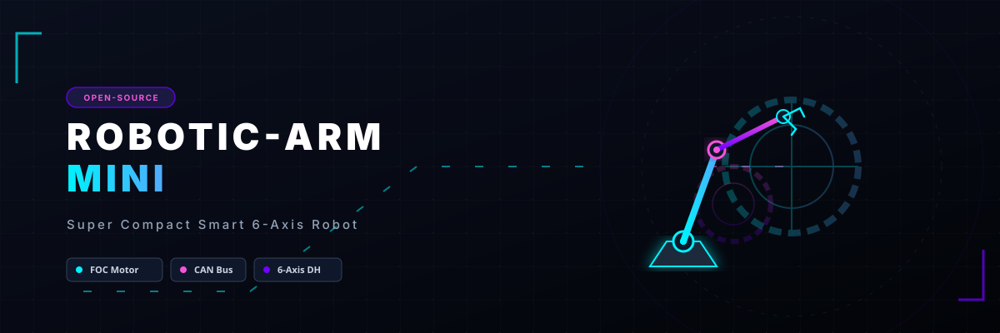
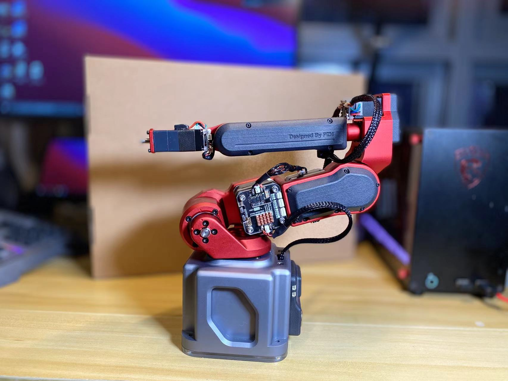
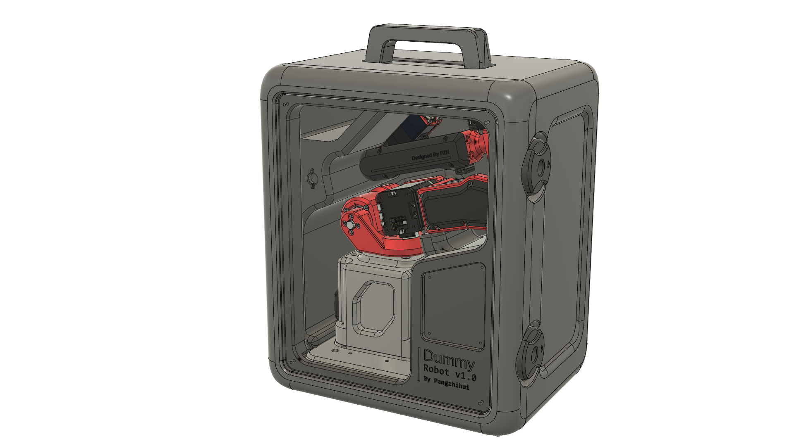
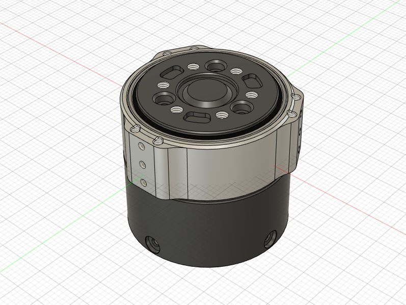
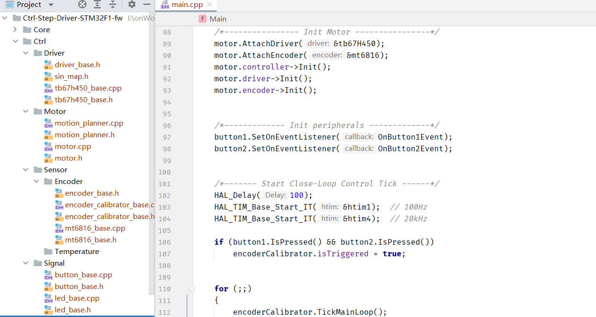
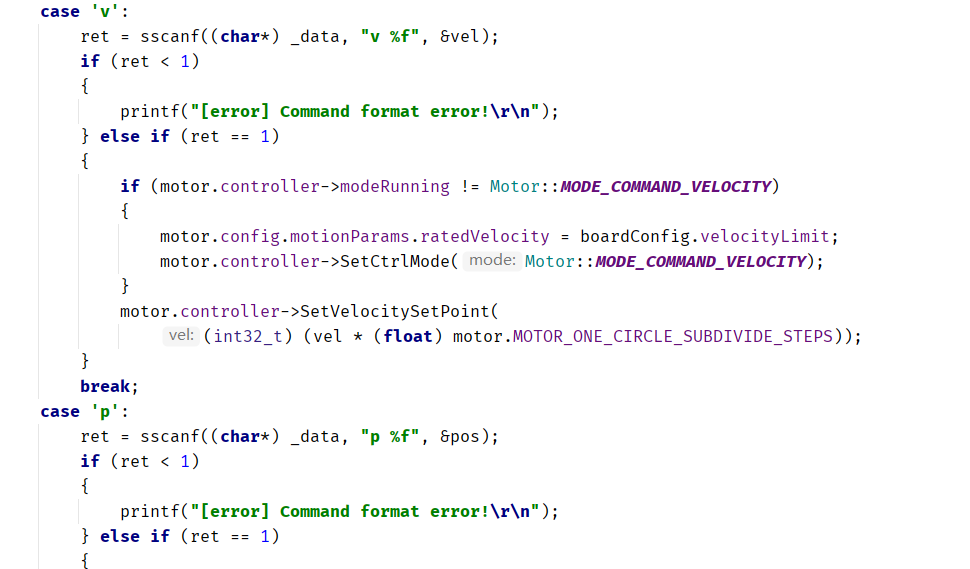
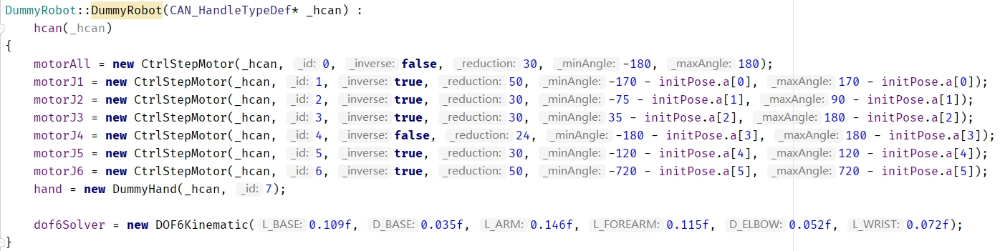
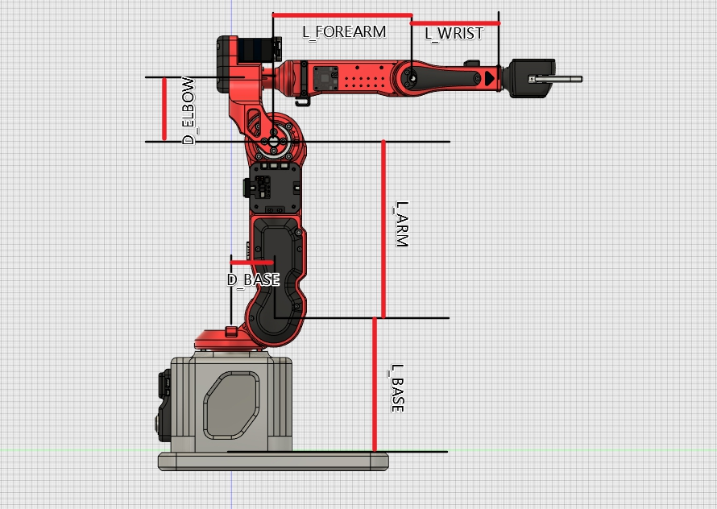

  

# 🤖 Robotic-Arm-Mini: Super compact smart robotic-arm 🦾

<meta name="description" content="Robotic-Arm-Mini: An open-source, super compact, smart 6-axis robotic arm with closed-loop stepper motor drivers, CAN bus communication, DH parameter kinematics calculations, and real-time interactive control. Built with dynamic simulation, FOC control, and trajectory planning." />
<meta name="keywords" content="robotic arm, open source robot, 6-axis robotic arm, compact robotic arm, smart robotic arm, FOC stepper motor, closed-loop driver, CAN bus control, DH parameters, inverse kinematics, robot kinematics, RoboDK, FreeRTOS, STM32 robot" />

  
  
  
  
  
  

> **✨ My super compact smart robotic arm project.**
>
> 📺 Video Introduction: [[DIY] I Built an IRON MAN Robotic Arm! [Hardcore]](https://www.bilibili.com/video/BV12341117rG)
>
> 🎥 Based on this Video : [I made a DUMMY ROBOTIC ARM from scratch！ - YouTube](https://www.youtube.com/watch?v=F29vrvUwqS4)

### Documentation (Updated 22-2-9)

* Added 3D model design source files.
* Added gripper hardware design files and LED ring PCB.
* Added wireless spatial positioning controller PCB files.
* Added wireless teach pendant Peak hardware and software project (as a submodule).
* Added REF hardware design files.
* Added DummyStudio host software.
* Added Dummy core controller firmware source code (see usage instructions below).
* Added 42 stepper motor driver hardware project.
* Added 20 stepper motor driver hardware project.
* Added 42/20 stepper motor driver firmware source code.
* Added command-line debugging tool reftool (based on odrivetool framework).
* Added portable suitcase model files.

> This is the complete design of the original robotic arm from the video. This design has high cost and manufacturing difficulty. Therefore, for those who want to reproduce it, I recommend waiting for the **Dummy Lite Version** which I will release later. This version will have the following improvements:
>
> 1. The whole machine structure is redesigned, using 3D printing as the manufacturing method (the original was aluminum CNC), significantly reducing manufacturing costs.
> 2. Uses a small cycloidal pinwheel reducer I designed to replace the original harmonic reducer, significantly reducing part costs.
> 3. All software and firmware are universal with the original, and the functions are exactly the same.
> 4. Adds a PC host software and mobile APP designed by me (trying to add user initialization setup guide).
> 5. Improves the original motor driver wiring method. The original power wiring was soldered, which is inconvenient for installation and removal. The upcoming Lite version will use a 4p connector (Power + CAN bus) for connection.
> 6. Will strive to keep the total machine cost under 2000.
> 7. **Most importantly, I will find someone to make a step-by-step video tutorial!**

## 🏗️ About Structural Design

The original design in my video uses a `Stepper Motor` + Harmonic `Harmonic Drive Module`. The latter is quite expensive (I bought a second-hand one for about 600 RMB). Therefore, to allow everyone to easily reproduce this project, I will later add a low-cost solution with a `DIY Cycloidal Pinwheel Reducer` + `3D Printing`.

> Currently, the cycloidal reducer has been designed and is being verified. It is expected to be made using PC (or acrylic) cutting combined with 3D printing. The precision will decrease, but all functions remain unchanged. I hope to keep the total hardware cost under 2000 RMB.

The designed cycloidal reducer can be found in my other repository: [peng-zhihui/CycloidAcuratorNano ](https://github.com/peng-zhihui/CycloidAcuratorNano)

## ⚡ About Circuit Modules

To achieve the main robotic arm motion control functions, the circuit actually revolves around 4 core boards:

* REF Core Board
* REF Base Board (the controller circuit board inside the robotic arm base)
* Stepper Motor Driver
* Peak Teach Pendant

Among these, I have open-sourced the first two and Peak. When designing the stepper driver, I referred to: https://github.com/unlir/XDrive. This is a closed-loop driver open-sourced by a friend of mine, based on STM32. The driver comes in open-source and closed-source versions. The closed-source version, based on discrete MOSFETs, has extremely strong performance and complete functions. The open-source version uses ADC + chopper driver chips, has basic functions, but lacks CAN protocol.

I redesigned the PCB circuit of the driver (this project uses 20 and 42 steppers respectively, the 57 files are just for extension), added hardware support for CAN bus, and completely refactored the original core code. **Pre-compiled binary files are provided for direct flashing:**

**Main improvements are as follows:**

1. Refactored the code using C++11, introducing many high-level language features, while the bottom layer uses mixed C programming, without affecting code performance.
2. Completely decoupled hardware dependencies, making it easy to port to MCUs on other platforms in the future, removing redundant code, and making the code structured and logically clearer.
3. Added custom templates for CAN protocol and UART protocol.
4. Added simulated EEPROM parameter storage, which can save data after power off.
5. Added setting any position as the zero point, and ensures zeroing within half a turn bidirectionally (rather than unidirectional zeroing).
6. Fully compatible with STM32-HAL library, can use STM32CubeMX to directly generate configuration code.
7. Other improvements. For secondary development, you only need to focus on the files under the `UserApp` folder.

The usage of the Ctrl-Step driver is quite simple. After downloading the firmware, the motor will undergo encoder calibration upon first power-up. If successful, pressing button 1 on the next power-up will enter closed-loop mode. The motor can be controlled by sending commands via CAN or serial port. For command instructions, see `interface_can.cpp` and `interface_uart.cpp` in the `UserApp` folder of the source code:

> Functions of other buttons:
>
> * Pressing both buttons simultaneously upon power-up will automatically perform encoder calibration. If the first calibration fails, you can recalibrate this way.
> * Short press button 1 to switch between **Enable Closed-Loop / Disable Closed-Loop**.
> * Long press button 1 to restart the board.
> * Short press button 2 to clear stall protection.
> * Long press button 2 to zero the target value (e.g., if in position mode, the position will be zeroed).
>
> Other functions need to be set through code or communication protocols, such as setting **home zero point**, **PID parameters**, CAN node ID, **various motion parameters**, etc. You can study the code yourself.

Of course, another way is that everyone can modify and use GRBL-type drivers to drive this robotic arm. The problem with this solution is that GRBL firmware is strongly coupled (after all, it's not designed for robotic arms but for CNC applications), making it inconvenient to expand. Additionally, the pulse-type control method makes wiring extremely inelegant (each joint requires a separate `step/dir` wire pulled to the controller, resulting in very long wiring for the last few joints).

By using the integrated closed-loop method, all motors can be connected in series. Using the CAN bus means the overall wiring requires only four wires (two for power positive/negative, two for CAN signal). In addition, the bus model allows the motor to work in `Torque`, `Velocity`, `Position`, and `Trajectory` modes, while pulse mode can only work in position and trajectory modes, making complex control impossible.

**As for Peak, I have already open-sourced both its hardware and software. You can check the README in the submodules folder for instructions.**

## 💾 About Core Firmware

The core of this robotic arm's firmware is the kinematics posture calculation. ~~I am still organizing this part, and it will be packaged more perfectly for open-sourcing later~~, **Now Open Sourced**. Many currently hard-coded parameters will be designed to be configurable, **making it convenient for everyone to port to their own designed robotic arms after learning from this project**; meanwhile, I ported the firmware from the LiteOS framework to the more familiar FreeRTOS to facilitate secondary development.

**REF Firmware Usage Instructions:**

The firmware mainly includes several functional modules:

* BSP Driver: Various on-board hardware drivers such as OLED, IMU, LED, buzzer, non-volatile storage, etc.
* 3rdParty Library: Includes U8G2 graphics library and Fibre serialization/deserialization library.
* Core: ST's official HAL library.
* Driver: ARM's CMSIS driver.
* Midwares: FreeRTOS support package.
* Robot: Core robotics library, including various algorithms and driver code.
* UserApp: Upper-layer application, you can develop other applications yourself based on the API interfaces I provided.

> * The OLED is ported from Arduino's U8G2 library, which can conveniently display various debugging and system information. Additionally, since STM32's hardware I2C has bugs, software I2C is used to drive the screen here. In testing, the frame rate is higher than hardware I2C.

The `RoboticArmMini` class is the complete definition of Dummy. During initialization, you need to set up the **stepper motor driver information** and **its own DH parameters**:

The driver information includes: CAN node ID, **whether it is reversed**, the reduction ratio of the reducer, and **motion limit range**.

The meaning of DH parameters is as follows:

The configuration of the robotic arm needs to meet the Pieper criterion (three adjacent joint axes of the robot intersect at one point or three axes are parallel) to obtain an analytical solution. So everyone can modify it according to the structure of Dummy, and then replace the DH parameters yourself to port my code.

> About position memory and power-on zero calibration:
>
> **Since the position of the absolute encoder is only valid within one turn, industrial robotic arms generally encode at the output end after deceleration to obtain the absolute position, but this reduces the precision by 30 times (reduction ratio). So it is more reasonable to use `Dual Encoders` or a low `Power Encoder + Battery`; however, in my project, dual encoders would affect the compact design, so I used a more clever way: utilizing the current loop of the motor driver to perform a low-torque directional motion without a zero point after power-up. After hitting the mechanical arm limit, it confirms a rough zero point (sensorless limit homing), and then fine-tunes the zero point based on the position of the single-turn absolute encoder. The zero point of this method has no error and is almost unaffected by machining accuracy, because within 12 degrees (360/30) is the valid accuracy range of the absolute encoder.**

**Peak Firmware Instructions:**

Peak is based on the X-Track project. You can check the Peak repository for more details.

## 🖥️ About Host Software

The software simulation in the video is based on RoboDK. In the video, I developed a Driver connecting to Dummy (the official documentation introduces the driver part. The original was based on a TCP network interface, I changed it to a serial port and made it compatible with dummy's protocol). However, because this software is paid, I also developed my own host software based on Unity3D, which has been published in the repository.

The host software is currently not planned for open source because there are still many functions to add. I hope to eventually make it into a general software similar to RoboDK, which everyone can use when making their own robotic arms in the future. Of course, the software will certainly be free.

## 🧮 About Control Algorithms

First, the kinematics part has been implemented. Both forward and inverse kinematics are calculated using traditional DH parameters. Forward kinematics (finding the end effector pose from joint angles) is a unique solution and relatively easy. Inverse kinematics (finding joint angles from end effector pose) involves multiple solutions (generally 8). The algorithm I use here is **solving for the configuration among the multiple solutions that has the smallest maximum joint angle change between the previous pose and the target pose**. This ensures the robotic arm always switches postures with the minimum rotation angle.

Then, for the conversion from joint angles to motor driver input signals, I use a trapezoidal acceleration/deceleration curve for speed and position planning. For example, in a MoveJ command, when a joint angle motion command is received, the controller calculates the motion angle differences to get 6 differential angles, then takes the largest angle θ among the 6 differential angles, calculates the time required to move angle θ based on the set JointSpeed parameter (considering acceleration and deceleration), uses this time as the motion parameter for the other 5 motors to calculate their respective acceleration/deceleration & maximum speed, and then the 6 motors move synchronously according to the calculated parameters. This ensures synchronization and smoothness.

Additionally, the six motors are connected using the CAN bus. Each motor receives information from two IDs (its own ID and ID 0). ID 0 is used for information broadcasting and synchronization. After the motor receives a motion command, it stores the information in a shadow register and starts moving upon receiving the broadcast synchronization signal. This further ensures motor synchronization.

Finally, the dynamics part is still under development and has not been fully implemented yet. **For the kinematics and dynamics algorithms mentioned above, I strongly recommend reading the book "Introduction to Robotics"**, which explains them in great detail.

## ⚙️ Command Modes

The Robotic-Arm-Mini firmware supports three different command modes (commands can be received via USB, Serial, CAN). The characteristics of different modes vary, see the table below:

| | Command Frequency | Command Execution | Interruptible by New Commands | Pause Between Commands | Suitable Scenarios |
| --- | --- | --- | --- | --- | --- |
| SEQ (Sequential Commands) | Random, Low (<5Hz) | Executed sequentially in FIFO queue | No | Yes | Send several key points' poses at once, wait for them to execute sequentially, ensuring key points are reached; however, since there is a process of decelerating to 0 between key points, there is a certain pause; suitable for scenarios like **visual grasping, palletizing, etc.** |
| INT (Interactive Commands) | Random, Unlimited | Command overwrite, immediate execution | Yes | No | Used for real-time control. New commands overwrite executing commands for an immediate response; however, if a series of commands are sent at once, the effect will be that only the last one is executed; suitable for scenarios like **action synchronization**. |
| `ToDo` TRJ (Trajectory Tracking) | Fixed, High (200Hz) | Automatic interpolation, fixed cycle execution | No | No | Suitable for applications requiring precise trajectory tracking, speed will be reduced; example scenarios include **3D printing, engraving, painting, etc.** |

---

> **Thanks to the authors of the following projects:**
>
> * [unlir/XDrive: Stepper motor with multi-function interface and closed loop function. (github.com)](https://github.com/unlir/XDrive)
> * [odriverobotics/ODrive: High performance motor control (github.com)](https://github.com/odriverobotics/ODrive)
> * [olikraus/u8g2: U8glib library for monochrome displays, version 2 (github.com)](https://github.com/olikraus/u8g2)
> * [samuelsadok/fibre: Abstraction layer for painlessly building object oriented distributed systems that just work (github.com)](https://github.com/samuelsadok/fibre)

# Robotic-Arm-Mini
